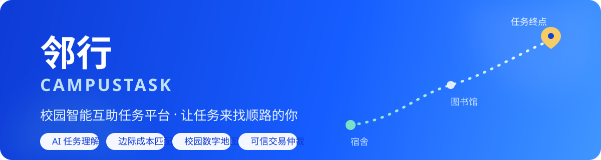
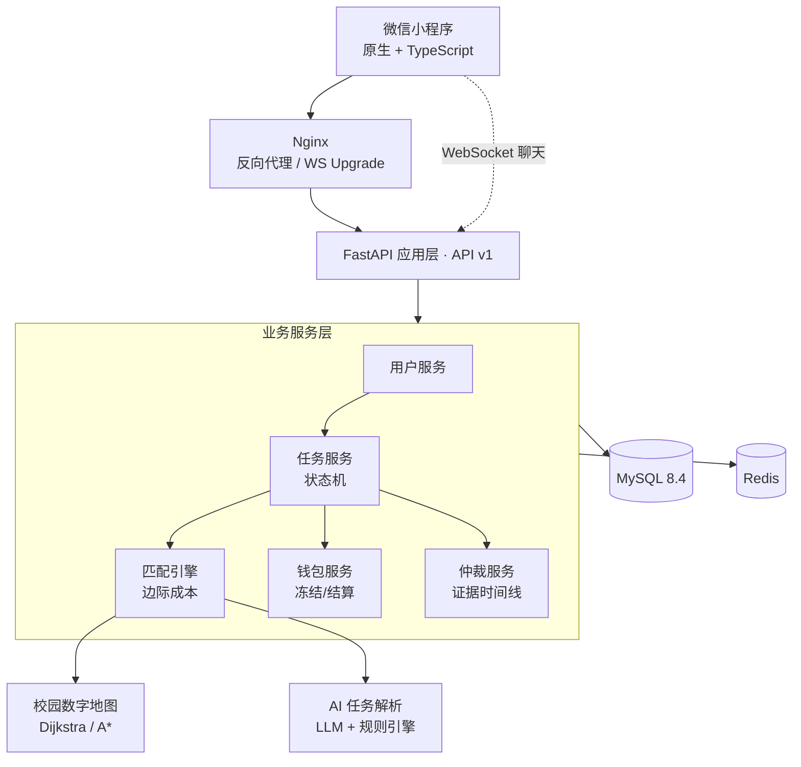
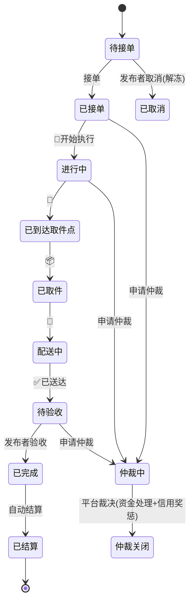

<div align="center">



<h1>邻行 CampusTask</h1>

<p><strong>校园智能互助任务平台 —— 让每一个经过某个地方的人，都可能成为一次「顺路服务者」</strong></p>

<p>
  
  
  
  
  
  
  
</p>

<p>
  <a href="#-快速开始">快速开始</a> ·
  <a href="#-四大创新点">创新点</a> ·
  <a href="#-系统架构">系统架构</a> ·
  <a href="#-核心算法">核心算法</a> ·
  <a href="#-api-一览">API</a> ·
  <a href="docs/PRD.md">PRD</a> ·
  <a href="docs/COMPETITION.md">赛事布局</a>
</p>

</div>

---

## 🎯 项目定位

「邻行」**不是**校园跑腿平台，而是一个基于**校园数字地图**和 **AI 智能匹配**的**学生闲置运力共享平台**——让用户在日常出行过程中顺路完成他人的小任务，以更低成本实现校园互助。

> 学生 A：「帮我从西门菜鸟驿站取个快递送到中海国际，给 5 块。」
> 系统发现学生 B 的日常路线是 `中海国际 → 西门 → 学一食堂`，与任务高度重合，
> 于是**让任务去找 B**，而不是让 B 去找任务。B 顺路完成，A 验收，自动结算。

| 从 | 到 |
| :-- | :-- |
| 人找任务 | **任务找人** |
| 最短路径 | **最低边际成本** |
| 陌生交易 | **校园可信交易** |
| 单次跑腿 | **校园互助生态** |

首期封闭场景：**南开大学津南校区**（地图规模可控、用户集中、任务类型明确）。

## 💡 四大创新点

| # | 创新点 | 说明 |
|---|--------|------|
| 1 | **校园低成本互助经济** | 把学生的闲置时间 + 日常出行路线，转化为可交易的校园闲置运力 |
| 2 | **基于边际成本的智能匹配** | 不是"谁离任务最近"，而是"谁完成它增加的额外路程/时间最少" |
| 3 | **校园数字地图 + AI 任务理解** | 自然语言 → 任务结构化 → 地点识别 → 路径规划 → 接单推荐 全链路 |
| 4 | **任务可信交易闭环** | 身份认证 → 资金冻结 → 执行留痕 → 验收结算 → 信用评价 → 仲裁 |

<details>
<summary><b>与传统跑腿平台的对比</b></summary>

| 维度 | 传统跑腿 | 邻行 |
|---|---|---|
| 服务者 | 专业骑手 | 校园普通用户 |
| 接单方式 | 平台派单 / 抢单 | 按顺路程度推荐，自由选择 |
| 核心逻辑 | 配送 | 顺路互助 |
| 服务费 | 相对较高 | 低额悬赏 + 极低撮合服务费 |
| 地图 | 通用导航 | 校园专属数字地图 |
| 匹配依据 | 距离为主 | 路线 + 时间 + 信用 + 收益 |
| 信用 | 骑手/商家体系 | 校园信用分生态 |
| 仲裁 | 平台客服 | 任务证据链仲裁 |
| AI | 通常不是核心 | AI 任务理解 + 智能匹配 |

</details>

## ✨ 功能矩阵

| 模块 | 能力 | 状态 |
|------|------|:--:|
| 用户系统 | 学号注册登录、校园身份认证、公开信用档案 | ✅ |
| AI 任务解析 | 一句话发布：LLM 引擎 + 离线规则引擎双保险 | ✅ |
| 智能匹配 | 边际成本排序、0–100 顺路匹配度、"为我推荐" | ✅ |
| 校园地图 | 津南校区 22 节点 / 43 边、Dijkstra + A*、别名解析 | ✅ |
| 任务状态机 | 9 主状态 + 仲裁分支，服务端强校验 | ✅ |
| 实时聊天 | WebSocket 任务聊天室、快捷操作驱动状态机、结束自动归档 | ✅ |
| 虚拟钱包 | 发布冻结 → 验收结算 → 仲裁冻结，流水可审计 | ✅ |
| 仲裁系统 | 证据时间线 + 规则引擎裁决建议 + 管理员裁决 | ✅ |
| 信用体系 | 信用分奖惩、好评率、低信用接单限制 | ✅ |
| 微信登录 | code2session 一键登录 | 🗓 W6 |
| 鸿蒙版本 | HarmonyOS 原生应用（C4-AI 方向） | 🗓 规划中 |

## 🏗 系统架构



## 📍 任务状态机



## 🧮 核心算法

### 边际成本匹配（创新点 2）

平台不寻找"最近的人"，而寻找**额外成本最低的人**：

$$MC = Cost\big(原路线 + 任务\big) - Cost\big(原路线\big)$$

$$Score = w_1\!\left(1-\tfrac{MC_d}{D_0}\right) + w_2\!\left(1-\tfrac{MC_t}{T_0}\right) + w_3\!\cdot\!\tfrac{Credit}{120} + w_4\!\cdot\!\tfrac{Reward}{R_0}$$

- **Best Insertion**：将 `取件 → 送达` 有序插入用户日常路线，取使总成本最小的位置
- 取送点恰好在原路线上且顺序一致时 `MC = 0` —— 即"完全顺路"
- 实测示例（种子数据）：任务 `西门菜鸟驿站 → 中海国际`，顺路的李同学（路线经西门）匹配度 **80%**（边际 420m），跨校区的张同学仅 **36%**（边际 2415m）

> 该算法可独立抽象为数学建模作品（多任务批量分配 → CVRP），详见 [docs/COMPETITION.md](docs/COMPETITION.md)。

### AI 任务解析（创新点 3）

```
"帮我下午五点去西门菜鸟驿站拿快递送到中海，给5块"
        │
        ▼  LLM 引擎（OpenAI 兼容 API）/ 规则引擎兜底（离线可用）
{
  "task_type": "快递取送",
  "start":     "cainiao_west  (西门菜鸟驿站)",
  "destination": "zhonghai    (中海国际宿舍区)",
  "deadline":  "17:00",
  "reward":    5
}
```

## 🚀 快速开始

### 方式一：本地运行（零依赖，SQLite）

```bash
cd server
python -m venv .venv && source .venv/bin/activate   # Windows: .venv\Scripts\activate
pip install -r requirements.txt
cp .env.example .env

python -m scripts.seed        # 演示数据：4 个账号（密码 campustask-demo），各预存 50 元
uvicorn app.main:app --reload
```

- API 文档（Swagger）：<http://127.0.0.1:8000/docs>
- 健康检查：<http://127.0.0.1:8000/health>

### 方式二：Docker Compose（生产形态）

```bash
cp server/.env.example server/.env   # 按需修改
docker compose up -d --build
# Nginx 暴露在 :80，内含 MySQL 8.4 + Redis 7
```

### 小程序端

1. 微信开发者工具导入 `miniprogram/`
2. 修改 `miniprogram/utils/config.ts` 中的 `baseUrl` 为后端地址（真机调试用局域网 IP）
3. 编译运行，使用种子账号登录（如 `20261111 / campustask-demo`）

### 运行测试

```bash
cd server && pytest        # 26 passed：图算法 / 匹配 / 状态机 / 钱包 / 仲裁 / 端到端 API
```

## 📡 API 一览

| 分组 | 端点 | 说明 |
|------|------|------|
| 认证 | `POST /api/v1/auth/register` · `POST /api/v1/auth/login` | 注册 / 登录（JWT） |
| 用户 | `GET /users/me` · `POST /users/me/routes` | 信用档案 / 登记日常路线 |
| AI | `POST /api/v1/ai/parse` | 自然语言 → 结构化任务 |
| 任务 | `POST /tasks` · `GET /tasks` · `POST /tasks/{id}/accept` | 发布（冻结悬赏）/ 大厅 / 接单 |
| 任务 | `POST /tasks/{id}/advance` · `/confirm` · `/cancel` · `/review` | 状态推进 / 验收结算 / 取消 / 评价 |
| 匹配 | `GET /match/tasks/{id}/candidates` · `GET /match/for-me` | 为任务找人 / 任务找我 |
| 地图 | `GET /map/nodes` · `/map/edges` · `/map/route` · `/map/resolve` | 校园图与路径 |
| 钱包 | `GET /wallet/me` · `POST /wallet/recharge` · `GET /wallet/transactions` | 余额 / 充值 / 流水 |
| 仲裁 | `POST /tasks/{id}/arbitrate` · `POST /arbitrations/{id}/evidence` · `/resolve` | 发起 / 证据 / 裁决 |
| 聊天 | `GET /tasks/{id}/messages` · `WS /api/v1/ws/chat/{task_id}` | 历史 / 实时（含快捷操作） |

## 🗂 目录结构

```
CampusTask/
├── README.md                  ← 你在这里
├── docker-compose.yml         # app + mysql + redis + nginx
├── deploy/nginx.conf
├── docs/
│   ├── PRD.md                 # 产品需求文档
│   ├── ARCHITECTURE.md        # 系统架构设计
│   ├── ROADMAP.md             # 10 周计划 + 3 人分工
│   ├── COMPETITION.md         # 华为ICT / 数维杯 / 创新创业赛布局
│   └── assets/banner.svg
├── server/                    # FastAPI 后端
│   ├── app/
│   │   ├── campus_map/        # 校园图 + Dijkstra/A* + 边际成本（含津南图数据）
│   │   ├── ai/                # 自然语言任务解析（LLM + 规则引擎）
│   │   ├── services/          # 状态机 / 匹配 / 钱包 / 信用 / 仲裁
│   │   ├── models/  schemas.py  api/v1/  core/  db/
│   │   └── main.py
│   ├── scripts/seed.py        # 演示数据
│   └── tests/                 # 26 项 pytest
└── miniprogram/               # 微信小程序（原生 + TypeScript，7 页面）
    ├── pages/                 # 附近任务/发布/详情/聊天/我的/钱包/登录
    └── services/              # REST + WebSocket 封装
```

## 🏆 赛事布局

> 原则：**不一稿多投**。同一核心项目拆分三个有独立成果侧重的版本。

```
              邻行 CampusTask
        ┌─────────┼─────────┐
        ▼         ▼         ▼
    产品版本   算法版本   商业版本
    华为 ICT   数维杯     经开杯 / 创新创业能力大赛
  (11-30 截止) (11-20)   (9-30 / 11-30)
```

- **华为 ICT 创新赛**（主战场）：AI + ICT 全链路方案，W9 适配昇腾/华为云
- **数维杯**：边际成本任务分配与多任务路径优化模型
- **经开杯 / 创新创业能力大赛**：商业模式 + 津南校区真实运营数据
- 下一届**三创赛**：携验证过的运营模式主打商业化

详见 [docs/COMPETITION.md](docs/COMPETITION.md) 与 [docs/ROADMAP.md](docs/ROADMAP.md)。

## ⚠️ 合规与安全说明

- 比赛 Demo 使用**虚拟钱包**；正式上线不自建资金池，接入微信支付等持牌机构
- 密码 PBKDF2 哈希存储，JWT 鉴权，接口级角色权限校验
- 聊天室仅任务双方可见，任务结束自动归档；位置数据最小化采集
- 校园地图 v0.1 为示意坐标，正式上线前实地测绘校准（见 ROADMAP W5）

## 👥 团队

南开大学 · 计算机科学与技术

| 角色 | 职责 |
|------|------|
| 队长 / 算法与后端 | 匹配引擎、路径算法、AI 解析、后端架构 |
| 前端 / 产品 | 小程序、UI、演示视频 |
| 运营 / 数据 | 地图测绘、内测运营、商业模式 |

## 📄 License

[MIT](LICENSE) © 2026 CampusTask Team (Nankai University)

---

<div align="center">
<sub>人找任务 → 任务找人 ｜ 最短路径 → 最低边际成本 ｜ 陌生交易 → 校园可信交易 ｜ 单次跑腿 → 校园互助生态</sub>
</div>
